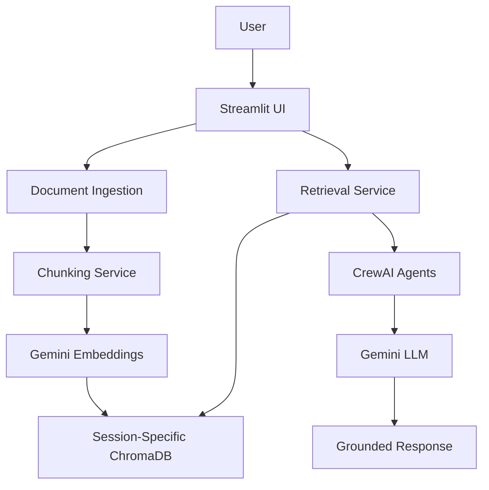
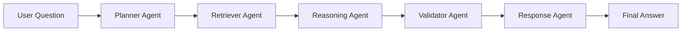

# Enterprise Document Intelligence System

Project Link - https://enterprise-doc-assistant-whgc.onrender.com/

## Overview

Enterprise Document Intelligence System is an Agentic Retrieval-Augmented Generation (RAG) application that enables users to upload enterprise documents and interact with them using natural language.

The system combines Google Gemini, ChromaDB, LangChain, and CrewAI to provide semantic search, grounded responses, source citations, and multi-agent reasoning.

---

## Key Features

### Document Processing

* PDF Support
* TXT Support
* CSV Support
* Excel Support (.xlsx)
* JSON Support

### Retrieval-Augmented Generation (RAG)

* Semantic Search
* Query Embeddings
* Top-K Retrieval
* Context Injection
* Grounded Responses
* Source Citations

### Agentic AI

* Planner Agent
* Retriever Agent
* Reasoning Agent
* Validator Agent
* Response Agent

### Reliability & Safety

* File Validation
* File Size Limits
* Prompt Injection Detection
* Error Handling
* Request Logging
* Response Logging
* Hallucination Reduction

### User Experience

* Streamlit Chat Interface
* Session-Based Chat History
* Session-Specific Vector Collections
* Multi-Document Question Answering

---

## System Architecture



---

## Agent Workflow



---

## Technology Stack

| Layer           | Technology               |
| --------------- | ------------------------ |
| Frontend        | Streamlit                |
| LLM             | Gemini 2.5 Flash         |
| Embeddings      | Google Gemini Embeddings |
| Framework       | LangChain                |
| Agent Framework | CrewAI                   |
| Vector Database | ChromaDB                 |
| Data Processing | Pandas, PyPDF            |
| Deployment      | Render                   |

---

## Project Structure

```text
enterprise-doc-assistant/
│
├── app/
│   ├── agents/
│   ├── core/
│   ├── models/
│   ├── prompts/
│   ├── services/
│   ├── utils/
│   └── vectorstore/
│
├── data/
├── docs/
├── tests/
│
├── main.py
├── requirements.txt
├── render.yaml
├── .env
└── README.md
```

---

## Installation

### Clone Repository

```bash
git clone <repository-url>

cd enterprise-doc-assistant
```

### Create Virtual Environment

```bash
python -m venv venv
```

### Activate Environment

Windows:

```bash
venv\Scripts\activate
```

Linux/Mac:

```bash
source venv/bin/activate
```

### Install Dependencies

```bash
pip install -r requirements.txt
```

---

## Environment Variables

Create a `.env` file in the project root:

```env
GEMINI_API_KEY=YOUR_API_KEY

TOP_K_RESULTS=5

CHUNK_SIZE=1000

CHUNK_OVERLAP=200
```

---

## Run Locally

```bash
streamlit run main.py
```

---

## Deployment

The application is configured for deployment on Render.

```yaml
services:
  - type: web
    name: enterprise-doc-assistant

    runtime: python

    buildCommand: |
      pip install -r requirements.txt

    startCommand: |
      streamlit run main.py --server.port $PORT --server.address 0.0.0.0
```

---

## Challenges Faced

### Dependency Compatibility Issues

During deployment, several package versions were incompatible with the selected Python version, causing installation failures.

Resolution:

* Cleaned and simplified requirements.txt
* Verified package compatibility
* Standardized deployment environment

### Session Isolation

A shared vector database collection could expose uploaded documents across users.

Resolution:

* Implemented session-specific ChromaDB collections
* Isolated document retrieval per user session

### Hallucination Reduction

Large language models may answer from prior knowledge when retrieval quality is poor.

Resolution:

* Context grounding
* Source citations
* Validation agent
* Retrieval safeguards

---

## Current Limitations

* ChromaDB is locally hosted
* No OCR support for scanned PDFs
* No authentication layer
* Prompt injection detection is rule-based
* Agent workflows increase response latency

---

## Future Enhancements

* OCR Support
* Authentication & User Management
* Pinecone / Qdrant Integration
* Hybrid Search
* Response Streaming
* Feedback System
* Evaluation Framework
* Knowledge Graph Integration

---

## Documentation

Detailed project documentation is available in the `docs/` directory:

* Project_Overview.md
* System_Architecture.md
* Agent_Workflow.md
* Deployment_Guide.md
* Challenges_And_Learnings.md
* Future_Enhancements.md

---

## Author

Sudhanshu Dhyani

Generative AI Developer | Mendix Developer | AI & Automation Enthusiast
