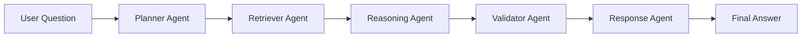

# Agent Workflow

## Agentic Architecture

The system uses CrewAI to coordinate specialized agents.

## Planner Agent

### Purpose

Understand the user query and determine what information is required.

### Responsibilities

* Analyze intent
* Determine information needs
* Plan response structure

---

## Retriever Agent

### Purpose

Review retrieved chunks and identify relevant information.

### Responsibilities

* Context analysis
* Evidence identification
* Relevance filtering

---

## Reasoning Agent

### Purpose

Generate a grounded answer using retrieved evidence.

### Responsibilities

* Context interpretation
* Answer synthesis
* Knowledge integration

---

## Validator Agent

### Purpose

Verify factual grounding.

### Responsibilities

* Hallucination reduction
* Context verification
* Consistency checks

---

## Response Agent

### Purpose

Generate the final user-facing response.

### Responsibilities

* Formatting
* Readability improvements
* Response presentation

---

## Benefits of Agentic AI

* Better task specialization
* Improved explainability
* Reduced hallucinations
* Modular architecture
* Easier future expansion
