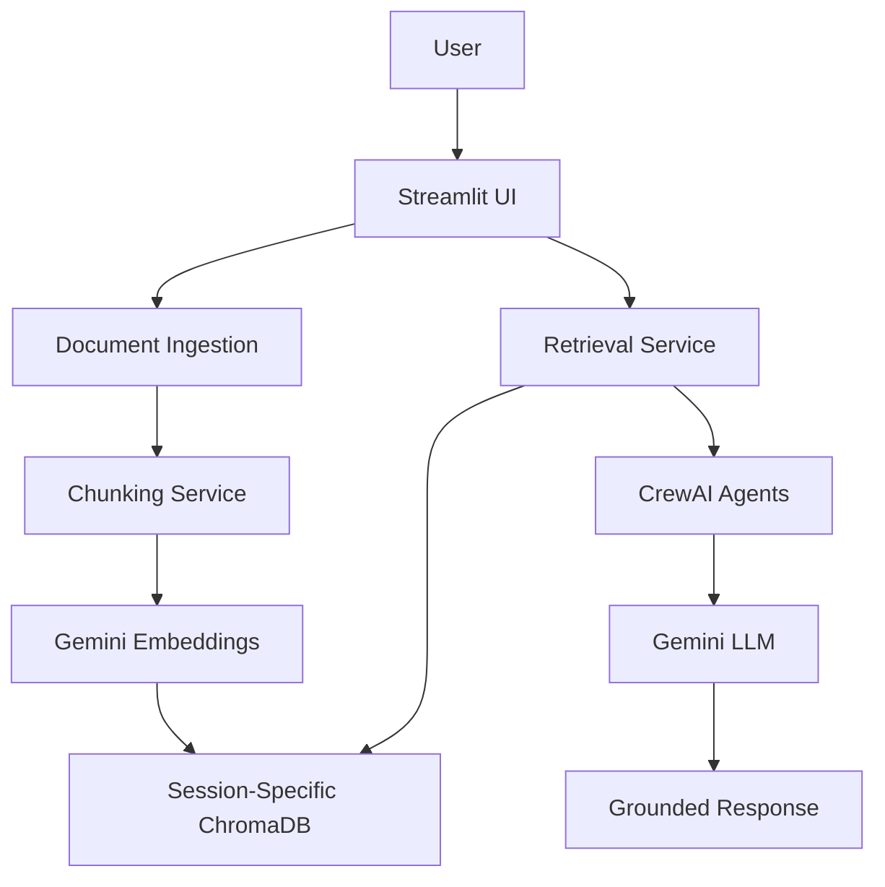

# System Architecture

## Architecture Overview

The system follows a layered architecture to separate concerns and improve maintainability.

## Presentation Layer

Responsible for user interaction.

Components:

* File Upload Interface
* Chat Interface
* Session History
* Status Monitoring

Technology:

* Streamlit

---

## Document Processing Layer

Responsible for:

* File Validation
* Content Extraction
* Metadata Extraction
* Document Preparation

Supported Formats:

* PDF
* TXT
* CSV
* XLSX
* JSON

---

## Chunking Layer

Documents are split into manageable chunks.

Implemented Strategies:

* Fixed Chunking
* Overlapping Chunking
* Recursive Chunking

Selected Strategy:

Recursive Chunking

Reason:

Provides better semantic preservation while maintaining chunk size constraints.

---

## Embedding Layer

Responsibilities:

* Convert text into vectors
* Preserve semantic meaning
* Enable similarity search

Model:

Google Gemini Embeddings

---

## Vector Database Layer

Technology:

ChromaDB

Responsibilities:

* Store embeddings
* Store metadata
* Similarity search

Session Isolation:

Each Streamlit session creates an independent collection to prevent cross-user data access.

---

## Retrieval Layer

Responsibilities:

* Generate query embeddings
* Perform semantic search
* Retrieve top-k chunks
* Return ranked context

---

## Intelligence Layer

CrewAI orchestrates multiple specialized agents.

Agents:

* Planner Agent
* Retriever Agent
* Reasoning Agent
* Validator Agent
* Response Agent

---

## Security Layer

Features:

* File Validation
* File Size Limits
* Prompt Injection Detection
* Logging
* Error Handling
